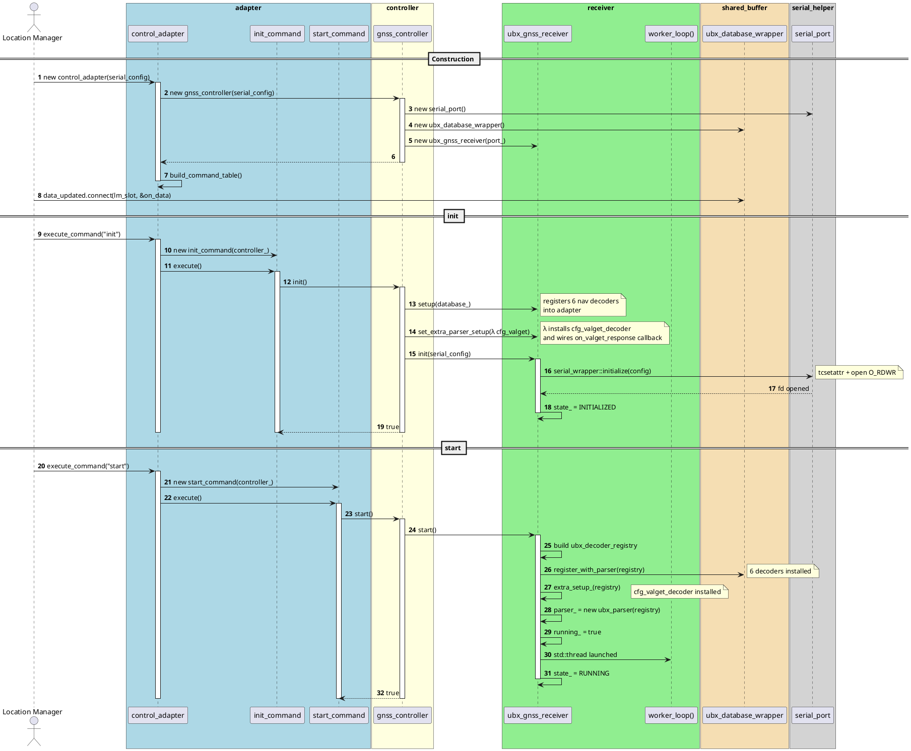
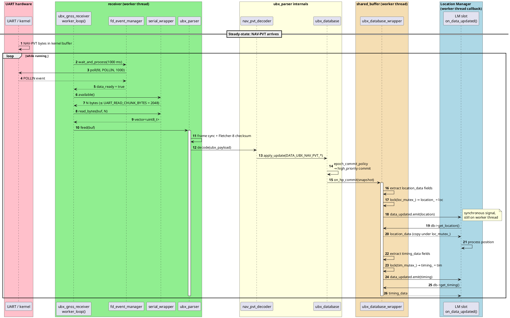
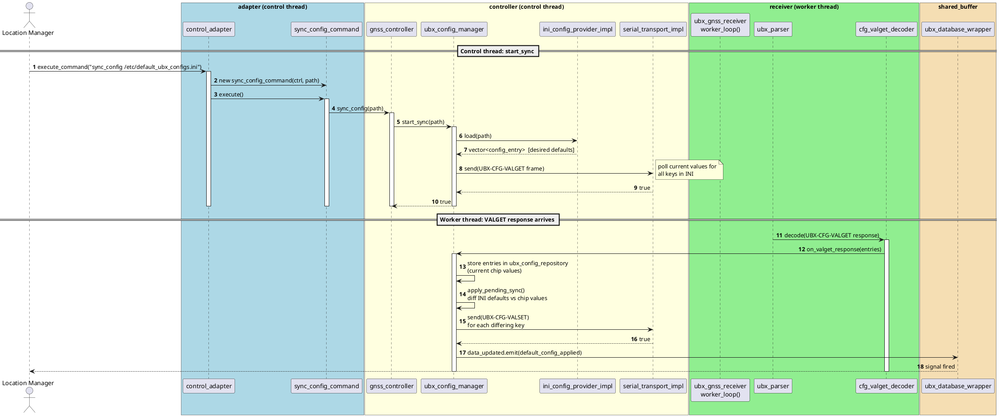
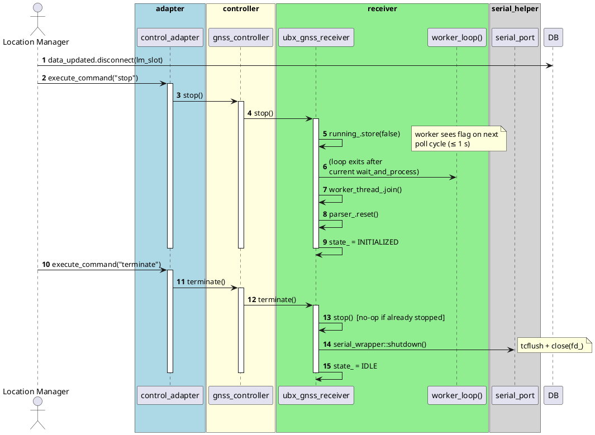

# GNSS Wrapper — u-blox HAL Library

A C++14 Hardware Abstraction Layer (HAL) for u-blox GNSS chipsets that exposes a
string-command control API to a Location Manager and publishes parsed navigation
data through typed shared buffers and a signal/slot notification mechanism.

---

## Table of Contents

1. [Module Overview and Design Intent](#module-overview-and-design-intent)
2. [Directory Structure](#directory-structure)
3. [Architecture](#architecture)
4. [Static View — Class Diagram](#static-view--class-diagram)
5. [Component Details](#component-details)
6. [Dynamic View — Sequence Diagrams](#dynamic-view--sequence-diagrams)
7. [Threading Model](#threading-model)
8. [Receiver Worker Loop](#receiver-worker-loop)
9. [Error Handling and Recovery](#error-handling-and-recovery)
10. [Build and Run Instructions](#build-and-run-instructions)
11. [Lifecycle and Usage](#lifecycle-and-usage)
12. [Command Reference](#command-reference)
13. [Shared Buffer Data Units](#shared-buffer-data-units)
14. [INI Configuration File Format](#ini-configuration-file-format)
15. [Troubleshooting](#troubleshooting)

---

## Module Overview and Design Intent

`gnss_wrapper` decouples Location Manager consumers from the low-level details of a
u-blox GNSS chipset connected over a POSIX UART. It integrates four external
libraries that are all bundled in `external_libs/`:

| Library | Role |
|---------|------|
| `serial_helper` | Thread-safe POSIX termios UART abstraction |
| `ubx_parser` | Stream-oriented UBX framer, decoder registry, epoch-commit database |
| `libevent` | Single-header signal/slot + `fd_event` (poll wrapper) + time-event scheduler |
| `ini_parser` | Flat/sectioned INI file loader |

**Design goals:**

| Goal | How it is met |
|------|---------------|
| Separation of concerns | Strict layer stack: Adapter → Controller → Receiver |
| Testability | All layers depend on abstract interfaces (`i_gnss_*`, `i_serial_port`) |
| Resilience | Worker loop never exits on transient errors; reconfigures and retries |
| Clean shutdown | `stop()` / `terminate()` lifecycle guarantee no resource leaks |
| Self-contained | All integration libraries bundled; no extra installs required |

---

## Directory Structure

```
gnss_wrapper/
├── global_definition/
│   ├── global_constants.h          # buffer_type enum, command name constants, tuning values
│   └── global_constants.cpp
├── adapter/
│   ├── i_gnss_adapter.h            # public string-command interface
│   ├── i_gnss_command.h            # command-pattern interface
│   ├── command_tokenizer.h         # parsed_command + tokenize() inline helper
│   ├── base_database.h / .cpp      # abstract base with data_updated signal
│   ├── control_adapter.h / .cpp    # command dispatch (Location Manager entry point)
│   └── commands/                   # 12 concrete i_gnss_command objects (one per command)
├── gnss_controller/
│   ├── i_gnss_controller.h         # lifecycle + chip-command interface
│   ├── gnss_controller.h / .cpp    # orchestrator; owns all sub-components
│   ├── serial_transport_impl.h / .cpp   # i_ubx_transport → serial_port write path
│   ├── ini_config_provider_impl.h / .cpp # i_ini_config_provider → ini_parser integration
│   └── ubx_config_repository.h / .cpp   # stores VALGET-read entries for diffing
├── gnss_receiver/
│   ├── i_gnss_receiver.h           # UART-reader interface
│   └── ubx_gnss_receiver.h / .cpp  # worker thread, fd_event loop, ubx_parser lifecycle
├── shared_buffer/
│   ├── location_data_buffer.h      # location_data POD (NAV-PVT fields)
│   ├── satellites_data_buffer.h    # satellites_data POD (up to 64 SVs from NAV-SAT)
│   ├── timing_data_buffer.h        # timing_data POD (TIM-TP + NAV-TIMEGPS)
│   └── ubx_database_wrapper.h / .cpp     # base_database impl; maps UBX epochs to shared buffers
├── examples/
│   ├── sample_usage.cpp            # 4 usage patterns (adapter / controller / receiver / db-only)
│   └── Makefile
└── external_libs/
    ├── lib_event/libevent.h        # sigslot + fd_event + time events (header-only)
    ├── serial_helper/              # i_serial_port, serial_port, serial_wrapper, serial_config
    └── ubx_parser/                 # ubx_parser, ubx_database, ubx_config_manager, builders
```

---

## Architecture

```
┌──────────────────────────────────────────────────────────────────────┐
│                         Location Manager                             │
│   execute_command(string)              db->data_updated.connect(...) │
└───────────────┬──────────────────────────────┬───────────────────────┘
                │ control path                 │ data path (signal)
                ▼                              ▼
┌──────────────────────────────────────────────────────────────────────┐
│  control_adapter  (i_gnss_adapter)                                   │
│  • tokenizes string commands                                         │
│  • dispatches via command_table_ (unordered_map of factory lambdas)  │
│  • exposes get_database() for signal subscription                    │
└──────────────┬───────────────────────────────────────────────────────┘
               │ owns  shared_ptr<gnss_controller>
               ▼
┌──────────────────────────────────────────────────────────────────────┐
│  gnss_controller  (i_gnss_controller)                                │
│  • lifecycle: init / start / stop / terminate                        │
│  • chip commands: hot/warm/cold start, backup, get_version           │
│  • config sync: ubx_config_manager + ini_config_provider_impl        │
│  • cmd_mutex_ serialises all control-thread calls                    │
│  • shared_ptr<serial_port> shared with receiver + transport          │
└──┬───────────────┬───────────────────────────┬───────────────────────┘
   │               │                           │
   ▼               ▼                           ▼
ubx_gnss_receiver  ubx_database_wrapper ubx_config_manager
(i_gnss_receiver) (base_database)       serial_transport_impl
• worker thread  • 6 UBX handlers       ini_config_provider_impl
• fd_event loop  • HP commit →          ubx_config_repository
• ubx_parser       location + timing
                 • LP commit →
                   satellites
                 • data_updated.emit()
                   ▼
             sigslot::signal<buffer_type>
                   ▼  (synchronous, on worker thread)
             Location Manager slot
```

### UBX data flow (UART bytes → Location Manager)

```
UART hardware
  └─► ubx_gnss_receiver::worker_loop()
        fd_event POLLIN → available() bytes → read → ubx_parser::feed()
  └─► ubx_parser (framing + checksum validation)
        └─► registered decoder (e.g. nav_pvt_decoder)
  └─► ubx_database_adapter → ubx_database::apply_update()
        epoch_commit_policy
          HP (NAV-PVT) ──► ubx_database_wrapper::on_hp_commit(snapshot)
                              update location_ + timing_
                              data_updated.emit(location)
                              data_updated.emit(timing)
          LP (NAV-SAT) ──► ubx_database_wrapper::on_lp_commit(snapshot)
                              update satellites_
                              data_updated.emit(satellites)
  └─► Location Manager slot (on_data_updated)
        db->get_location() / get_satellites() / get_timing()
```

---

## Static View — Class Diagram

```plantuml
@startuml gnss_wrapper_class_diagram
skinparam classAttributeIconSize 0
skinparam groupInheritance 2
hide empty members

' ─── Namespace gnss ──────────────────────────────────────────────────

package "gnss" {

  enum buffer_type {
    location
    satellites
    timing
    default_config_applied
  }

  interface i_gnss_adapter {
    +execute_command(cmd: string): bool
  }

  interface i_gnss_command {
    +execute(): bool
  }

  class parsed_command {
    +name: string
    +args: vector<string>
  }

  class control_adapter implements i_gnss_adapter {
    -controller_: shared_ptr<gnss_controller>
    -command_table_: unordered_map<string, CommandFactory>
    +control_adapter(config: serial_config)
    +execute_command(cmd: string): bool
    +get_database(): shared_ptr<ubx_database_wrapper>
    -build_command_table()
    -create_command(p: parsed_command): unique_ptr<i_gnss_command>
  }

  note right of control_adapter
    CommandFactory =
    function<unique_ptr<i_gnss_command>(parsed_command)>
  end note

  class init_command implements i_gnss_command {
    -ctrl_: shared_ptr<i_gnss_controller>
    +execute(): bool
  }
  class start_command implements i_gnss_command
  class stop_command implements i_gnss_command
  class terminate_command implements i_gnss_command
  class check_running_command implements i_gnss_command
  class hot_start_command implements i_gnss_command
  class warm_start_command implements i_gnss_command
  class cold_start_command implements i_gnss_command
  class get_version_command implements i_gnss_command
  class backup_command implements i_gnss_command
  class clear_backup_command implements i_gnss_command
  class sync_config_command implements i_gnss_command {
    -ini_path_: string
  }

  interface i_gnss_controller {
    +init(): bool
    +start(): bool
    +stop(): void
    +terminate(): void
    +is_running(): bool
    +hot_start(): bool
    +warm_start(): bool
    +cold_start(): bool
    +get_version(): bool
    +backup(): bool
    +clear_backup(): bool
    +sync_config(path: string): bool
  }

  class gnss_controller implements i_gnss_controller {
    -config_: serial_config
    -port_: shared_ptr<serial_port>
    -database_: shared_ptr<ubx_database_wrapper>
    -receiver_: shared_ptr<ubx_gnss_receiver>
    -transport_: shared_ptr<serial_transport_impl>
    -ini_provider_: shared_ptr<ini_config_provider_impl>
    -config_repo_: shared_ptr<ubx_config_repository>
    -config_manager_: unique_ptr<ubx_config_manager>
    -cmd_mutex_: mutex
    +gnss_controller(config: serial_config)
    +~gnss_controller()
  }

  interface i_gnss_receiver {
    +init(config: serial_config): bool
    +start(): bool
    +stop(): void
    +terminate(): void
    +is_running(): bool
    +setup(db: shared_ptr<ubx_database_wrapper>): void
    +set_extra_parser_setup(cb: function): void
    +set_raw_message_callback(cb: raw_message_callback_t): void
  }

  class ubx_gnss_receiver implements i_gnss_receiver {
    -port_: shared_ptr<i_serial_port>
    -config_: serial_config
    -db_: shared_ptr<ubx_database_wrapper>
    -extra_setup_: function<void(ubx_decoder_registry&)>
    -raw_msg_cb_: raw_message_callback_t
    -parser_: unique_ptr<ubx_parser>
    -running_: atomic<bool>
    -worker_thread_: thread
    -state_mutex_: mutex
    -state_: state
    +ubx_gnss_receiver(port: shared_ptr<i_serial_port>)
    -worker_loop(): void
    -reconfigure_port(): void
  }

  enum "ubx_gnss_receiver::state" as receiver_state {
    idle
    initialized
    running
  }

  ubx_gnss_receiver +-- receiver_state

  abstract class base_database {
    +data_updated: signal<buffer_type>
    +get_location(): location_data
    +get_satellites(): satellites_data
    +get_timing(): timing_data
  }

  class ubx_database_wrapper extends base_database {
    -db_: shared_ptr<ubx_database>
    -adapter_: unique_ptr<ubx_database_adapter>
    -loc_mutex_: mutex
    -sat_mutex_: mutex
    -tim_mutex_: mutex
    -location_: location_data
    -satellites_: satellites_data
    -timing_: timing_data
    +register_with_parser(registry: ubx_decoder_registry&): void
    -on_hp_commit(snap: ubx_location_snapshot): void
    -on_lp_commit(snap: ubx_location_snapshot): void
  }
}

' ─── Shared buffers ──────────────────────────────────────────────────

package "gnss::shared_buffer" {
  class location_data <<POD>> {
    +latitude_deg: double
    +longitude_deg: double
    +altitude_ellipsoid_mm: int32_t
    +altitude_msl_mm: int32_t
    +h_accuracy_mm: uint32_t
    +v_accuracy_mm: uint32_t
    +vel_n/e/d_mmps: int32_t
    +ground_speed_mmps: int32_t
    +vehicle_heading_deg: double
    +fix_type: uint8_t
    +num_sv: uint8_t
    +utc_timestamp_ms: int64_t
    +valid: bool
  }

  class satellites_data <<POD>> {
    +num_svs: uint8_t
    +svs[64]: satellite_record
    +valid: bool
  }

  class satellite_record <<POD>> {
    +gnss_id: uint8_t
    +sv_id: uint8_t
    +cno: uint8_t
    +elevation_deg: int8_t
    +azimuth_deg: int16_t
    +used: bool
    +has_almanac/ephemeris/healthy: bool
  }

  class timing_data <<POD>> {
    +tow_ms: uint32_t
    +q_err_ps: int32_t
    +gps_tow_ms: uint32_t
    +gps_week: int16_t
    +leap_seconds: int8_t
    +valid: bool
  }

  satellites_data *-- satellite_record
}

' ─── Config subsystem ─────────────────────────────────────────────────

package "ubx::config" {
  interface i_ubx_transport {
    +send(msg: vector<uint8_t>): bool
  }
  interface i_ini_config_provider {
    +load(path: string): bool
    +get_all_entries(): vector<config_entry>
  }
  interface i_ubx_config_repository {
    +store(key: uint32_t, val: uint64_t): void
    +get_all(): vector<config_entry>
  }

  class serial_transport_impl implements i_ubx_transport {
    -port_: shared_ptr<serial_port>
  }
  class ini_config_provider_impl implements i_ini_config_provider {
    -entries_: vector<config_entry>
  }
  class ubx_config_repository implements i_ubx_config_repository
  class ubx_config_manager {
    +start_sync(ini_path: string): bool
    +on_valget_response(decoded): void
    +apply_pending_sync(): bool
  }
}

' ─── serial_helper ────────────────────────────────────────────────────

package "serial" {
  interface i_serial_port {
    +open(config): void
    +close(): void
    +is_open(): bool
    +get_fd(): int
    +available(): int
    +read_bytes(...): int
    +write_bytes(...): int
    +reconfigure(config): bool
  }

  class serial_port implements i_serial_port {
    -fd_: int
    -config_: serial_config
    -mutex_: mutex
  }

  class serial_wrapper {
    -port_: weak_ptr<i_serial_port>
    +initialize(config): void
    +shutdown(): void
    +is_ready(): bool
    +get_fd(): int
    +available(): int
    +read_bytes(...): int
    +write_bytes(...): int
    +reconfigure(config): bool
  }

  class serial_config <<POD>> {
    +device_path: string
    +baud: baud_rate
    +data: data_bits
    +par: parity
    +stop: stop_bits
    +flow: flow_control
    +read_timeout_ms: int
    +non_blocking: bool
    +{static} gnss_default(dev): serial_config
    +{static} gnss_high_speed(dev): serial_config
  }
}

' ─── sigslot (libevent) ───────────────────────────────────────────────

package "sigslot" {
  class base_slot {
  }
  class "signal<Args...>" as Signal {
    +connect(receiver, slot_fn): void
    +disconnect(receiver, slot_fn): void
    +emit(args...): void
  }
}

' ─── Relationships ────────────────────────────────────────────────────

control_adapter o-- gnss_controller
control_adapter ..> i_gnss_command : creates & executes

init_command --> i_gnss_controller
start_command --> i_gnss_controller
stop_command --> i_gnss_controller
terminate_command --> i_gnss_controller
check_running_command --> i_gnss_controller
hot_start_command --> i_gnss_controller
warm_start_command --> i_gnss_controller
cold_start_command --> i_gnss_controller
get_version_command --> i_gnss_controller
backup_command --> i_gnss_controller
clear_backup_command --> i_gnss_controller
sync_config_command --> i_gnss_controller

gnss_controller o-- ubx_gnss_receiver
gnss_controller o-- ubx_database_wrapper
gnss_controller o-- serial_port
gnss_controller o-- ubx_config_manager
gnss_controller o-- serial_transport_impl
gnss_controller o-- ini_config_provider_impl
gnss_controller o-- ubx_config_repository

ubx_gnss_receiver o-- i_serial_port
ubx_gnss_receiver o-- ubx_database_wrapper

ubx_database_wrapper --> location_data : stores
ubx_database_wrapper --> satellites_data : stores
ubx_database_wrapper --> timing_data : stores
base_database *-- Signal : data_updated

serial_wrapper --> i_serial_port : weak_ptr
serial_port ..|> i_serial_port

ubx_config_manager --> i_ubx_transport
ubx_config_manager --> i_ini_config_provider
ubx_config_manager --> i_ubx_config_repository

serial_transport_impl --> serial_port

@enduml
```



---

## Component Details

### `control_adapter` (`i_gnss_adapter`)

The sole entry point for the Location Manager.

- Tokenizes incoming string commands using `command_tokenizer::tokenize()`.
- Dispatches via an `unordered_map<string, CommandFactory>` built in `build_command_table()`.
  Each factory lambda captures a `shared_ptr<i_gnss_controller>` and constructs
  the appropriate concrete `i_gnss_command` object.
- `execute_command()` returns the `bool` result of the created command's `execute()`.
- `get_database()` returns the `ubx_database_wrapper` so the caller can subscribe to
  `data_updated` before the first `start`.
- **Not thread-safe at this layer** — thread-safety is the caller's responsibility.

### `gnss_controller` (`i_gnss_controller`)

Orchestrates the entire HAL lifetime and owns all sub-components.

- Constructs `serial_port`, `ubx_database_wrapper`, `ubx_gnss_receiver`,
  `serial_transport_impl`, `ini_config_provider_impl`, `ubx_config_repository`,
  and `ubx_config_manager` in its constructor.
- Every public method acquires `cmd_mutex_` to serialise control-thread calls.
- `init()` wires the database and the CFG-VALGET decoder into the receiver via
  `receiver_->setup()` and `receiver_->set_extra_parser_setup()`, then opens the
  serial port via `receiver_->init(config_)`.
- `sync_config(path)` calls `config_manager_->start_sync(path)`, which sends
  UBX-CFG-VALGET over UART. When the response arrives on the worker thread,
  `config_manager_->apply_pending_sync()` diffs the live values against the INI
  defaults and sends UBX-CFG-VALSET as needed.
- Destructor calls `stop()` then `terminate()`.

### `ubx_gnss_receiver` (`i_gnss_receiver`)

Owns the UART reader thread and the `ubx_parser` lifecycle.

- Holds a `shared_ptr<i_serial_port>` so production code passes a real
  `serial_port` and tests inject a `mock_serial_port`.
- `start()` rebuilds the decoder registry from scratch on every call:
  database decoders first (`db_->register_with_parser()`), then the
  optional `extra_setup_` callback (used for `cfg_valget_decoder`).
- `stop()` sets `running_ = false`, joins the worker, and resets `parser_`.
- See [Receiver Worker Loop](#receiver-worker-loop) for the per-cycle logic.

### `ubx_database_wrapper` (`base_database`)

Maps parsed UBX epoch-commit snapshots to typed shared buffers and emits
`data_updated` signals.

Registers 6 UBX message handlers during construction:
`db_nav_pvt_handler`, `db_nav_sat_handler`, `db_nav_dop_handler`,
`db_nav_timegps_handler`, `db_nav_status_handler`, `db_tim_tp_handler`.

Two commit callbacks wired to `ubx_database`:
- **`on_hp_commit(snap)`** — fires on every NAV-PVT epoch. Extracts all
  `location_data` fields + all `timing_data` fields from the snapshot.
  If both are valid, emits `buffer_type::location` then `buffer_type::timing`.
- **`on_lp_commit(snap)`** — fires on every NAV-SAT epoch. Fills up to 64
  `satellite_record` entries, emits `buffer_type::satellites`.

`get_location()`, `get_satellites()`, `get_timing()` each lock their own
dedicated mutex and return a copy — safe to call from any thread.

### Config subsystem

| Class | Interface | Purpose |
|-------|-----------|---------|
| `serial_transport_impl` | `i_ubx_transport` | `send()` creates a transient `serial_wrapper` per call, writes UBX bytes to the shared `serial_port` |
| `ini_config_provider_impl` | `i_ini_config_provider` | Loads INI file via `ini_parser`, resolves key names through `ubx_cfg_key_registry`, returns `vector<config_entry>` |
| `ubx_config_repository` | `i_ubx_config_repository` | Stores VALGET-read key/value pairs for comparison with INI defaults |
| `ubx_config_manager` | — | Orchestrates the 4-step sync: load INI → send VALGET → receive VALGET response → send VALSET for differing keys |

---

## Dynamic View — Sequence Diagrams

### 1. Startup Sequence



---

### 2. Normal Data Flow — NAV-PVT Epoch



---

### 3. Config Sync (CFG-VALGET → CFG-VALSET)



---

### 4. Graceful Shutdown



---

## Threading Model

| Thread | Owner | Protected resources | Synchronisation |
|--------|-------|---------------------|-----------------|
| Control / LM thread | Application | All `gnss_controller` methods | `cmd_mutex_` (one mutex, all commands) |
| UART worker thread | `ubx_gnss_receiver` | `parser_`, serial fd read path | `running_` (atomic); `state_mutex_` for lifecycle transitions |
| Parser callbacks | Same as worker thread | — | Single-threaded; no extra lock in feed path |
| Database buffer writes | Worker thread | `location_`, `satellites_`, `timing_` | Per-buffer mutexes: `loc_mutex_`, `sat_mutex_`, `tim_mutex_` |
| Signal emission | Worker thread | `data_updated` connection list | `sigslot` internal mutex in `signal::emit()` |

**`serial_port` fd sharing:** The `serial_port` is `shared_ptr`-shared between:
- `ubx_gnss_receiver` — reads on the worker thread via a `serial_wrapper` created at
  the top of `worker_loop()`.
- `serial_transport_impl` — writes on the control thread via a transient
  `serial_wrapper` created per `send()` call.

Both paths go through `serial_port::mutex_`, which serialises fd access at the OS level.

**Signal slot lifetime:** Subscriber classes must inherit `sigslot::base_slot`.
Disconnect from `data_updated` **before** destroying the subscriber object to
prevent dangling slot pointers.

---

## Receiver Worker Loop

`worker_loop()` runs on the dedicated UART worker thread. A local
`fd_event::fd_event_manager` (a thin `poll(2)` wrapper) monitors the UART fd
with a **1-second timeout per cycle**.

```
Create serial_wrapper(port_)
Create fd_event_manager fdm
current_fd = -1

while (running_.load()):

  fd = wrapper.get_fd()
  if fd < 0:
    log "invalid fd"
    reconfigure_port()
    continue

  if fd != current_fd:
    fdm.remove_fd(current_fd)      // remove stale fd after reconnect
    fdm.add_fd(fd, POLLIN, cb)     // cb sets data_ready / io_error flags
    current_fd = fd

  ret = fdm.wait_and_process(UART_FD_WAIT_TIMEOUT_MS = 1000)

  if ret == 0:                      // timeout
    log "no data in 1 second"
    reconfigure_port()
    continue

  if ret < 0:                       // poll() error
    log errno
    reconfigure_port()
    continue

  if io_error:                      // POLLERR | POLLHUP | POLLNVAL
    log "UART error or hangup"
    reconfigure_port()
    continue

  if data_ready:                    // POLLIN
    avail = wrapper.available()     // ioctl(FIONREAD)
    if avail <= 0:
      continue                      // spurious wake

    n = wrapper.read_bytes(buf, min(avail, UART_READ_CHUNK_BYTES))
    if n > 0:
      parser_->feed(buf)
    elif n < 0:
      log "read error"
      reconfigure_port()
```

**fd change after `reconfigure_port()`:** `serial_port::reconfigure()` closes and
re-opens the UART device, yielding a new `fd`. The worker detects the change on
the next iteration, removes the stale fd from `fdm`, and registers the new one.

**Resilience:** The loop never breaks on any transient error. The Location Manager
can always call `start()` to resume data flow after a temporary stall.

---

## Error Handling and Recovery

| Scenario | Worker behaviour |
|----------|-----------------|
| `get_fd()` returns -1 | Log "invalid fd", call `reconfigure_port()`, continue |
| `wait_and_process()` returns 0 (timeout) | Log "no data in 1 second", `reconfigure_port()`, continue |
| `wait_and_process()` returns -1 (poll error) | Log errno, `reconfigure_port()`, continue |
| `POLLERR` / `POLLHUP` / `POLLNVAL` | Log "UART error or hangup", `reconfigure_port()`, continue |
| `available()` ≤ 0 | Spurious wake-up, continue without reading |
| `read_bytes()` returns -1 | Log "read error", `reconfigure_port()`, continue |
| `reconfigure_port()` returns false | Log warning; next cycle retries |
| `reconfigure_port()` throws | Log exception message; loop continues |
| Checksum failure in parser | `ubx_parser` fires error callback; loop continues |
| `serial_port` `init()` fails | `gnss_controller::init()` returns `false`; no side effects |
| Unknown command string | `execute_command()` returns `false`; no state change |
| INI file missing or unparseable | `sync_config()` returns `false`; chip config unchanged |

---

## Lifecycle and Usage

### Receiver state machine

```
        init(config)              start()
IDLE ─────────────► INITIALIZED ──────────► RUNNING
  ▲                     ▲                      │
  │                     └───────── stop() ─────┘
  └──────────────── terminate() ────────────────
```

- `init()` opens the serial port; `terminate()` closes it.
- `stop()` joins the worker thread but leaves the port open.
- `start()` can be called again after `stop()` without re-opening the port.

### Typical `control_adapter` usage (recommended)

```cpp
#include "adapter/control_adapter.h"
#include "external_libs/serial_helper/serial_config.h"

// ----- Subscriber (must inherit sigslot::base_slot) -----
class LocationManagerSubscriber : public sigslot::base_slot {
public:
    std::shared_ptr<gnss::ubx_database_wrapper> db;

    void on_data_updated(gnss::buffer_type type) {
        if (type == gnss::buffer_type::location) {
            auto loc = db->get_location();
            if (loc.valid)
                printf("lat=%.7f lon=%.7f\n", loc.latitude_deg, loc.longitude_deg);
        }
    }
};

// ----- Application startup -----
gnss::control_adapter adapter(
    serial::serial_config::gnss_default("/dev/ttyS3"));

auto sub = std::make_shared<LocationManagerSubscriber>();
sub->db  = adapter.get_database();
sub->db->data_updated.connect(sub.get(), &LocationManagerSubscriber::on_data_updated);

adapter.execute_command("init");    // open UART, wire parser
adapter.execute_command("start");   // launch worker thread

// Optional chip commands:
adapter.execute_command("hot_start");
adapter.execute_command("get_version");
adapter.execute_command("backup");
adapter.execute_command("sync_config /etc/default_ubx_configs.ini");

// ----- Application teardown -----
adapter.execute_command("stop");
adapter.execute_command("terminate");
// Disconnect before sub is destroyed:
sub->db->data_updated.disconnect(sub.get(), &LocationManagerSubscriber::on_data_updated);
```

### Direct `gnss_controller` usage

```cpp
#include "gnss_controller/gnss_controller.h"

gnss::gnss_controller ctrl(
    serial::serial_config::gnss_default("/dev/ttyS3"));

if (!ctrl.init())  { /* handle error */ }
if (!ctrl.start()) { /* handle error */ }

ctrl.sync_config("/etc/default_ubx_configs.ini");

ctrl.stop();
ctrl.terminate();
```

---

## Command Reference

| Command string | Method called | Notes |
|----------------|---------------|-------|
| `init` | `gnss_controller::init()` | Open serial port, wire decoders |
| `start` | `gnss_controller::start()` | Launch UART worker thread |
| `stop` | `gnss_controller::stop()` | Join worker; port stays open; always returns `true` |
| `terminate` | `gnss_controller::terminate()` | Join worker + close port; always returns `true` |
| `check_running` | `gnss_controller::is_running()` | `true` if worker thread is active |
| `hot_start` | `gnss_controller::hot_start()` | UBX-CFG-RST, all aiding data kept |
| `warm_start` | `gnss_controller::warm_start()` | UBX-CFG-RST, almanac kept, ephemeris cleared |
| `cold_start` | `gnss_controller::cold_start()` | UBX-CFG-RST, all aiding data cleared |
| `get_version` | `gnss_controller::get_version()` | Poll UBX-MON-VER; response via parser callback |
| `backup` | `gnss_controller::backup()` | UBX-UPD-SOS: save aiding to battery-backed RAM |
| `clear_backup` | `gnss_controller::clear_backup()` | UBX-UPD-SOS: clear saved aiding data |
| `sync_config <path>` | `gnss_controller::sync_config(path)` | INI path as argument; defaults to `/etc/default_ubx_configs.ini` |

Argument parsing: the command string is split on whitespace. The first token is
the command name; subsequent tokens (up to `MAX_COMMAND_ARGS = 6`) are passed to
the command object as `args`.

---

## Shared Buffer Data Units

### `location_data` (from UBX-NAV-PVT)

| Field group | Fields | Units |
|-------------|--------|-------|
| Position | `latitude_deg`, `longitude_deg` | Degrees (converted from 1e-7 integer) |
| Altitude | `altitude_ellipsoid_mm`, `altitude_msl_mm` | mm (÷ 1 000 = metres) |
| Accuracy | `h_accuracy_mm`, `v_accuracy_mm`, `speed_accuracy_mmps` | mm or mm/s |
| Velocity | `vel_n_mmps`, `vel_e_mmps`, `vel_d_mmps`, `ground_speed_mmps` | mm/s |
| Heading | `vehicle_heading_deg`, `motion_heading_deg`, `magnetic_declination_deg` | Degrees |
| Fix quality | `fix_type` (0–5), `num_sv`, `flags`, `flags2` | — |
| UTC time | `year`, `month`, `day`, `hour`, `minute`, `second` | — |
| Sub-second | `millisecond` (`iTOW % 1000`), `microsecond` (`nano / 1000`) | ms / µs |
| Timestamp | `utc_timestamp_ms` | Unix milliseconds |

### `satellites_data` (from UBX-NAV-SAT)

- `num_svs`: number of visible SVs (capped at `GNSS_MAX_SV_COUNT = 64`)
- Per-SV: `gnss_id`, `sv_id`, `cno` (dBHz), `elevation_deg`, `azimuth_deg`,
  `used`, `has_almanac`, `has_ephemeris`, `healthy`, `diff_correction`,
  `sbas_correction`, `rtcm_correction`

### `timing_data` (from UBX-TIM-TP + UBX-NAV-TIMEGPS)

| Source | Fields | Units |
|--------|--------|-------|
| UBX-TIM-TP | `tow_ms`, `q_err_ps` | ms / ps |
| UBX-TIM-TP | `time_base`, `time_ref`, `utc_standard`, `utc_available`, `q_err_valid` | flags |
| UBX-NAV-TIMEGPS | `gps_tow_ms`, `gps_week`, `leap_seconds` | ms / weeks / s |

---

## INI Configuration File Format

`sync_config` loads a standard INI file. Keys may appear flat or inside section
headers (section prefix is stripped when matching against the `ubx_cfg_key_registry`).
Values must be **integers** (decimal or hex with `0x` prefix). Lines beginning
with `#` or `;` are comments; `[section]` headers are ignored.

```ini
# Example: /etc/default_ubx_configs.ini

[uart1]
uart1_baudrate = 115200

[rate]
rate_meas = 1000        ; measurement rate in ms

uart2_baudrate = 9600   ; flat key also accepted
```

Unknown key names are silently skipped. If the file is missing or unparseable,
`sync_config()` returns `false` and the chip configuration is left unchanged.

---

## Troubleshooting

### No location data received

1. Confirm the UART device path and baud rate in `serial_config::gnss_default()`.
2. Check stderr for `[ubx_gnss_receiver]` log output:
   - Repeated `"no data in 1 second"` → UART is silent; check wiring and chip power.
   - Repeated `"invalid fd"` → port cannot be opened; check `/dev/ttyS*` permissions.
3. Confirm both `init()` and `start()` returned `true`.
4. Verify the chip is configured to output UBX-NAV-PVT messages (required for
   the high-priority epoch commit and `buffer_type::location` signal).

### Repeated `reconfigure` messages in the log

Occasional reconfigures are normal on antenna connect/disconnect events.
Continuous rapid reconfigures indicate a **persistent UART fault**:
wrong baud rate, wrong device node, or hardware problem. Check `serial_config` settings.

### Parser silently drops frames

UBX checksum failures or unknown class/ID pairs cause `ubx_parser` to fire its
error callback (a no-op by default). To surface them:

```cpp
// After start(), before the first data arrives — extend ubx_gnss_receiver or
// use set_extra_parser_setup to register an error observer alongside nav decoders.
receiver->set_extra_parser_setup([](ubx::parser::ubx_decoder_registry& reg) {
    // install a custom error handler here if the parser API exposes one
    (void)reg;
});
```

### `sync_config` not applied

- Returns `false` if the INI file path is wrong or the file is unreadable.
- Check stderr for the `ini_config_provider_impl` error log.
- Make sure the key names match what `ubx_cfg_key_registry` knows; unknown keys
  are silently skipped.

### Worker thread does not stop within 1 second

`stop()` unblocks after at most `UART_FD_WAIT_TIMEOUT_MS = 1000 ms` once
`running_` is cleared. If the platform poll takes longer, increase the constant
in `global_constants.h` or add an `eventfd`-based wake-up to the worker loop.
