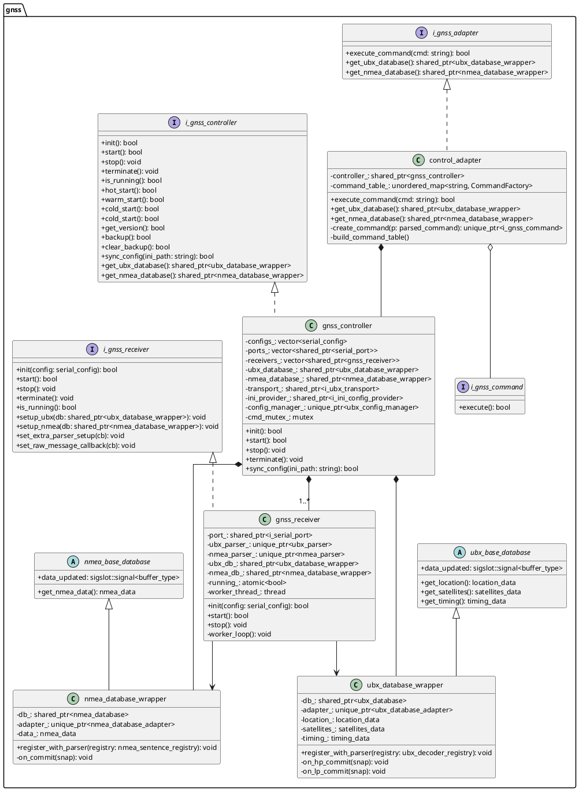
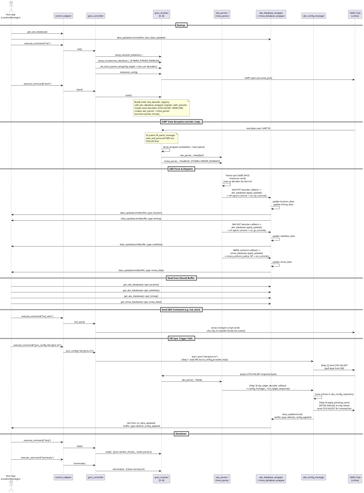

# gnss_wrapper

## Overview

`gnss_wrapper` is a C++ hardware-abstraction library for u-blox GNSS chips connected over UART.  It owns the entire pipeline from raw bytes off the wire to typed data buffers and chip control commands, and exposes a clean string-command interface to a host application (e.g. a Location Manager service).

Key design choices:

- **Multi-UART**: one *control* UART (index 0) for all out-going commands and configuration, plus any number of additional *data* UARTs that share the same parsed-data database.
- **Parser-agnostic database**: UBX and NMEA pipelines update independent shared buffers; callers subscribe to a single `data_updated` signal to receive incremental change notifications.
- **Command-pattern adapter**: the host application drives the library exclusively through `i_gnss_adapter::execute_command(std::string)`, keeping implementation details hidden.
- **Self-healing receiver loop**: transient UART errors never terminate the worker thread; the port is silently reconfigured and reading resumes.

---

## Key Features

- UART file-descriptor connection to u-blox GNSS chips via `serial_helper`.
- UBX binary message parsing (NAV-PVT, NAV-SAT, NAV-DOP, NAV-TIMEGPS, NAV-STATUS, TIM-TP, MON-VER, CFG-VALGET).
- Optional NMEA 0183 parsing (GGA, RMC, GSA, VTG, GSV) — enabled with `NMEA_PARSER_ENABLED` compile flag.
- `libevent`-backed file-descriptor monitoring (`fd_event::fd_event_manager`) and Qt-style signal-slot notifications (`sigslot::signal`).
- INI-file driven configuration with a **4-step VALGET/VALSET synchronisation** cycle to the chip.
- Hot-start, warm-start, cold-start resets and battery-RAM backup/restore commands.
- Thread-safe shared buffers: `location_data`, `satellites_data`, `timing_data`, `nmea_data`.

---

## Architecture

### Component Responsibilities

| Component | Namespace / File | Role |
|---|---|---|
| `control_adapter` | `gnss::` / `adapter/` | Service-facing entry point. Owns `gnss_controller`. Tokenises command strings and dispatches via the **Command pattern**. |
| `i_gnss_adapter` | `gnss::` / `adapter/` | Abstract interface for the adapter — what the host application depends on. |
| `gnss_controller` | `gnss::` / `gnss_controller/` | Top-level orchestrator. Owns ports, receivers, database wrappers and the config manager. Serialises control commands behind `cmd_mutex_`. |
| `i_gnss_controller` | `gnss::` / `gnss_controller/` | Abstract interface for the controller. |
| `gnss_receiver` | `gnss::` / `gnss_receiver/` | Owns the UART file descriptor (shared with the controller's write path). Runs the worker thread. Builds and drives `ubx_parser` / `nmea_parser`. |
| `ubx_database_wrapper` | `gnss::` / `shared_buffer/` | Wires `ubx_parser` database callbacks to the three shared buffers. Emits `data_updated` on each commit. |
| `nmea_database_wrapper` | `gnss::` / `shared_buffer/` | Same pattern as above for NMEA sentences. |
| `ubx_base_database` / `nmea_base_database` | `gnss::` / `adapter/` | Abstract bases providing `data_updated` signal and typed getters. |
| `serial_transport_impl` | `gnss::` / `gnss_controller/` | Implements `i_ubx_transport` over `serial_port`; used by `ubx_config_manager` to write UBX frames. |
| `ini_config_provider_impl` | `gnss::` / `gnss_controller/` | Implements `i_ini_config_provider`. Loads an INI file and maps keys to UBX configuration key IDs via `ubx_cfg_key_registry`. |
| `ubx_config_manager` | `ubx::config::` / `ext_libs/ubx_parser` | Drives the 4-step INI-sync cycle (load → VALGET → compare → VALSET). |

### Class Diagram



### Runtime Flow



---

## Message Pipeline

```
UART fd (u-blox chip)
       │
       ▼  poll() via fd_event::fd_event_manager (1 s timeout)
serial_wrapper::read_bytes()   ──  up to UART_READ_CHUNK_BYTES (2048) bytes per cycle
       │
       ├─► ubx_parser::feed(buf)
       │       │  0xB5 0x62 sync + checksum verify
       │       ├─► NAV-PVT decoder  →  ubx_database::apply_update()  →  HP commit
       │       │       →  on_hp_commit()  →  location_data + timing_data updated
       │       │       →  data_updated.emit(buffer_type::location / timing)
       │       ├─► NAV-SAT decoder  →  ubx_database::apply_update()  →  LP commit
       │       │       →  on_lp_commit()  →  satellites_data updated
       │       │       →  data_updated.emit(buffer_type::satellites)
       │       ├─► MON-VER decoder  →  data_updated.emit(buffer_type::chip_version)
       │       └─► CFG-VALGET decoder  →  config_manager_->on_valget_response()
       │               →  apply_pending_sync()  →  CFG-VALSET (if deltas exist)
       │               →  data_updated.emit(buffer_type::default_config_applied)
       │
       └─► nmea_parser::feed(buf)   [NMEA_PARSER_ENABLED only]
               │  skips UBX binary, re-syncs on '$'
               ├─► GGA / RMC / GSA / VTG / GSV sentence handlers
               └─► nmea_database::apply_update()  →  nmea_uniform_policy: always HP
                       →  on_commit()  →  nmea_data updated
                       →  data_updated.emit(buffer_type::nmea_data)
```

Both parsers receive the **same byte buffer** on every read cycle.  `nmea_parser` silently skips binary UBX frames and re-synchronises on the `$` ASCII character, so co-existence on one UART is transparent.

---

## Adapter Layer

`control_adapter` (`adapter/control_adapter.h`) is the only public-facing class an integrator needs to instantiate.

### Command Dispatch

```
execute_command("sync_config /etc/gnss.ini")
        │
        ▼
tokenize()  →  parsed_command { name="sync_config", args={"/etc/gnss.ini"} }
        │
        ▼
create_command()  →  sync_config_command(controller_, "/etc/gnss.ini")
        │
        ▼
i_gnss_command::execute()  →  gnss_controller::sync_config()
```

Each command is a lightweight `final` struct implementing `i_gnss_command` (the **Command pattern**).  The factory `create_command()` dispatches via an `unordered_map<string, CommandFactory>` built once in `build_command_table()`.

### Supported Commands

| Command string | Effect |
|---|---|
| `"init"` | Open serial port(s), wire databases to receivers. |
| `"start"` | Build parser registries, launch worker thread(s). |
| `"stop"` | Join worker thread(s); port stays open. |
| `"terminate"` | Stop + close serial port(s). |
| `"check_running"` | Returns `true` if control receiver thread is active. |
| `"hot_start"` | Send UBX-CFG-RST hot-start via control UART. |
| `"warm_start"` | Send UBX-CFG-RST warm-start. |
| `"cold_start"` | Send UBX-CFG-RST cold-start. |
| `"get_version"` | Poll UBX-MON-VER. |
| `"backup"` | Send UBX-UPD-SOS save command. |
| `"clear_backup"` | Send UBX-UPD-SOS clear command. |
| `"sync_config [path]"` | Run 4-step INI sync. Defaults to `DEFAULT_CONFIG_INI_PATH` if path is omitted. |

### Data Access

After construction, call `get_ubx_database()` (and optionally `get_nmea_database()`) to obtain the shared wrapper before the first `"init"`. Connect your slot **before** issuing `"init"` so no updates are missed.

```cpp
auto db = adapter.get_ubx_database();
db->data_updated.connect(this, &MyClass::on_gnss_update);
adapter.execute_command("init");
```

---

## Configuration and 4-Step INI Sync

`gnss_controller::sync_config(ini_path)` runs a fully **asynchronous** 4-step cycle:

| Step | Who | What |
|---|---|---|
| **1 — Load** | `ini_config_provider_impl::load(ini_path)` | Parses the INI file using `ini_parser`. Maps each `[section] key = value` entry to a UBX configuration key ID via `ubx_cfg_key_registry`. Unknown keys are silently skipped. |
| **2 — Poll** | `ubx_config_manager::start_sync()` | Builds and sends a UBX-CFG-VALGET request for all keys found in step 1 via `serial_transport_impl` (control UART). |
| **3 — Receive** | `cfg_valget_decoder` callback (receiver worker thread) | The CFG-VALGET response arrives on the control UART, is decoded by `cfg_valget_decoder`, and routed to `config_manager_->on_valget_response()` which stores current chip values in `ubx_config_repository`. |
| **4 — Apply** | `ubx_config_manager::apply_pending_sync()` | Diffs INI defaults against `ubx_config_repository`. Sends a single UBX-CFG-VALSET only for keys that differ. On completion (or if no delta exists), emits `data_updated(buffer_type::default_config_applied)`. |

Steps 1 and 2 are **synchronous** (called on the command-issuer's thread). Steps 3 and 4 execute on the **receiver worker thread** when the chip's response arrives.

### INI File Format

```ini
; Flat format — key name must match ubx_cfg_key_registry exactly
rate_meas = 1000
uart1_baudrate = 115200

; Sectioned format — section + key joined by '_' for registry lookup
[rate]
rate_meas = 1000

[uart1]
uart1_baudrate = 115200
```

Values must be integers. Unrecognised keys are silently skipped.

---

## Typical Usage

### Single-UART Initialization

```cpp
#include "adapter/control_adapter.h"
#include "serial_helper/serial_config.h"

// 1. Construct adapter with UART device path.
gnss::control_adapter adapter(
    serial::serial_config::gnss_default("/dev/ttyS3"));

// 2. Connect to data-updated signal BEFORE init.
auto db = adapter.get_ubx_database();
db->data_updated.connect(this, &LocationManager::on_gnss_update);

// 3. Lifecycle.
adapter.execute_command("init");
adapter.execute_command("start");
```

### Multi-UART Initialization

```cpp
std::vector<serial::serial_config> cfgs = {
    serial::serial_config::gnss_default("/dev/ttyS3"),  // control UART
    serial::serial_config::gnss_default("/dev/ttyS4"),  // data-only UART
};
gnss::control_adapter adapter(std::move(cfgs));

adapter.get_ubx_database()->data_updated.connect(
    this, &LocationManager::on_gnss_update);

adapter.execute_command("init");
adapter.execute_command("start");
```

### Registering Callbacks

```cpp
// Slot method in your class (must derive from sigslot::base_slot)
void LocationManager::on_gnss_update(gnss::buffer_type type)
{
    auto db = adapter_.get_ubx_database();
    switch (type)
    {
    case gnss::buffer_type::location:
        process(db->get_location());    // gnss::location_data
        break;
    case gnss::buffer_type::satellites:
        process(db->get_satellites());  // gnss::satellites_data
        break;
    case gnss::buffer_type::timing:
        process(db->get_timing());      // gnss::timing_data
        break;
    case gnss::buffer_type::default_config_applied:
        log("INI sync complete");
        break;
    default:
        break;
    }
}
```

### Reading from Shared Buffers (polling)

Thread-safe getters may be called from any thread at any time:

```cpp
const gnss::location_data&   loc  = db->get_location();
const gnss::satellites_data& sats = db->get_satellites();
const gnss::timing_data&     tim  = db->get_timing();

if (loc.valid)
{
    double lat = loc.latitude_deg;
    double lon = loc.longitude_deg;
}
```

For NMEA data (requires `NMEA_PARSER_ENABLED`):

```cpp
auto nmea_db = adapter.get_nmea_database();
nmea_db->data_updated.connect(this, &LocationManager::on_nmea_update);

// Inside on_nmea_update or polling:
const gnss::nmea_data& nd = nmea_db->get_nmea_data();
```

### Sending UBX Commands

```cpp
// Chip restart variants
adapter.execute_command("hot_start");
adapter.execute_command("warm_start");
adapter.execute_command("cold_start");

// Aiding-data backup
adapter.execute_command("backup");
adapter.execute_command("clear_backup");

// Firmware/hardware version
adapter.execute_command("get_version");
// result arrives via data_updated(buffer_type::chip_version)
```

### INI Sync

```cpp
// Using explicit path
adapter.execute_command("sync_config /etc/gnss_defaults.ini");

// Using compiled-in DEFAULT_CONFIG_INI_PATH
adapter.execute_command("sync_config");

// Completion notification arrives via:
// data_updated.emit(buffer_type::default_config_applied)
```

### Stop and Shutdown

```cpp
adapter.execute_command("stop");       // joins worker threads; ports stay open
adapter.execute_command("terminate");  // stops + closes all serial ports
```

---

## Threading / Event Model

### Threads

| Thread | Owner | Responsibility |
|---|---|---|
| **Worker thread** (one per UART) | `gnss_receiver` | Runs `worker_loop()`. Waits on `fd_event::fd_event_manager::wait_and_process()` (backed by `poll()`) and feeds received bytes to `ubx_parser` and `nmea_parser`. |
| **Command thread** | Caller (host app) | Any thread calling `execute_command()`. Protected by `gnss_controller::cmd_mutex_`. |

### Signals and Slots

`sigslot::signal<buffer_type>` from `libevent` provides a thread-safe publish-subscribe mechanism.  `data_updated` is emitted from the **receiver worker thread** and the slot is invoked synchronously on the same thread.  Slot implementations must be re-entrant or use their own locking if they update shared state.

### Shared-Buffer Concurrency

Each of the three UBX buffers (`location_data`, `satellites_data`, `timing_data`) is guarded by its own `std::mutex` inside `ubx_database_wrapper`.  HP/LP commit callbacks (writer) and `get_*()` getters (reader) both acquire the corresponding mutex.  The `nmea_data` buffer in `nmea_database_wrapper` is similarly protected by `data_mutex_`.

### Multi-Receiver Write Merging

When multiple UARTs share the same database, **last writer wins**: whichever receiver commits a message frame last sets the buffer value.  This is the correct semantics for a single physical GNSS chipset outputting the same navigation solution on several serial ports simultaneously.

---

## Error Handling and Recovery

| Scenario | Behaviour |
|---|---|
| `fd_event::wait_and_process` returns 0 (1 s timeout, no data) | Logs the event, calls `reconfigure_port()`, continues loop. |
| `poll()` error (`ret < 0`) | Calls `reconfigure_port()`, continues loop. |
| UART POLLERR / POLLHUP / POLLNVAL | Sets `io_error` flag, calls `reconfigure_port()`, continues loop. |
| `serial_wrapper::read_bytes()` returns `< 0` | Calls `reconfigure_port()`, continues loop. |
| `ubx_parser` checksum / framing error | Error callback installed (no-op by default); parser re-synchronises internally. |
| Invalid UART fd on loop entry | Immediately calls `reconfigure_port()`, continues. |
| `init()` failure for one receiver (multi-UART) | Partial-failure policy: other receivers still initialised; `init()` returns `false`. |
| `sync_config()` exception from config manager | Caught internally; `sync_config` returns `false`. No crash. |

`reconfigure_port()` calls `serial_wrapper::reconfigure(config_)` to re-open and reconfigure the UART without terminating the thread. The loop resumes immediately after reconfiguration, so a Location Manager service can issue a `"start"` command at any time to restart data flow.

---

## Extensibility

### Adding a New UBX Decoder

1. Implement a decoder class deriving from `ubx::parser::i_ubx_decoder` (in `ext_libs/ubx_parser`).
2. Before calling `execute_command("start")`, register it via `set_extra_parser_setup`:

```cpp
gnss_controller& ctrl = /* ... */;
ctrl.get_receiver(0)->set_extra_parser_setup(
    [](ubx::parser::ubx_decoder_registry& reg) {
        reg.register_decoder(std::make_unique<MyCustomDecoder>(...));
    });
```

> *Note: `gnss_controller` does not expose `get_receiver()` publicly — this extension point is accessed through `gnss_controller::init()` which installs the extra-setup callback on `receivers_[0]` internally. For custom decoders, subclass `gnss_controller` or inject the callback before calling `init()` through a factory.*

### Adding a New INI Configuration Key

Add the mapping to `ubx_cfg_key_registry` in `ext_libs/ubx_parser/include/config/ubx_cfg_key_registry.h`, then include the key name in the INI file. No changes to `gnss_wrapper` itself are needed.

### Raw Message Callback

For UBX frames that have no registered decoder, install a catch-all callback:

```cpp
receiver->set_raw_message_callback(
    [](const ubx::parser::ubx_raw_message& msg) {
        // Access msg.msg_class, msg.msg_id, msg.payload
    });
```

### Supporting a New UART

Pass additional `serial::serial_config` entries in the `vector` constructor of `control_adapter`:

```cpp
gnss::control_adapter adapter({
    serial::serial_config::gnss_default("/dev/ttyS3"),
    serial::serial_config::gnss_default("/dev/ttyS4"),
    serial::serial_config::gnss_default("/dev/ttyS5"),
});
```

All receivers share `ubx_database_wrapper` and `nmea_database_wrapper` automatically.

---

## License

`gnss_wrapper` is released under the **MIT License**.

```
MIT License

Permission is hereby granted, free of charge, to any person obtaining a copy
of this software and associated documentation files (the "Software"), to deal
in the Software without restriction, including without limitation the rights
to use, copy, modify, merge, publish, distribute, sublicense, and/or sell
copies of the Software, and to permit persons to whom the Software is
furnished to do so, subject to the following conditions:

The above copyright notice and this permission notice shall be included in all
copies or substantial portions of the Software.

THE SOFTWARE IS PROVIDED "AS IS", WITHOUT WARRANTY OF ANY KIND, EXPRESS OR
IMPLIED, INCLUDING BUT NOT LIMITED TO THE WARRANTIES OF MERCHANTABILITY,
FITNESS FOR A PARTICULAR PURPOSE AND NONINFRINGEMENT. IN NO EVENT SHALL THE
AUTHORS OR COPYRIGHT HOLDERS BE LIABLE FOR ANY CLAIM, DAMAGES OR OTHER
LIABILITY, WHETHER IN AN ACTION OF CONTRACT, TORT OR OTHERWISE, ARISING FROM,
OUT OF OR IN CONNECTION WITH THE SOFTWARE OR THE USE OR OTHER DEALINGS IN THE
SOFTWARE.
```
